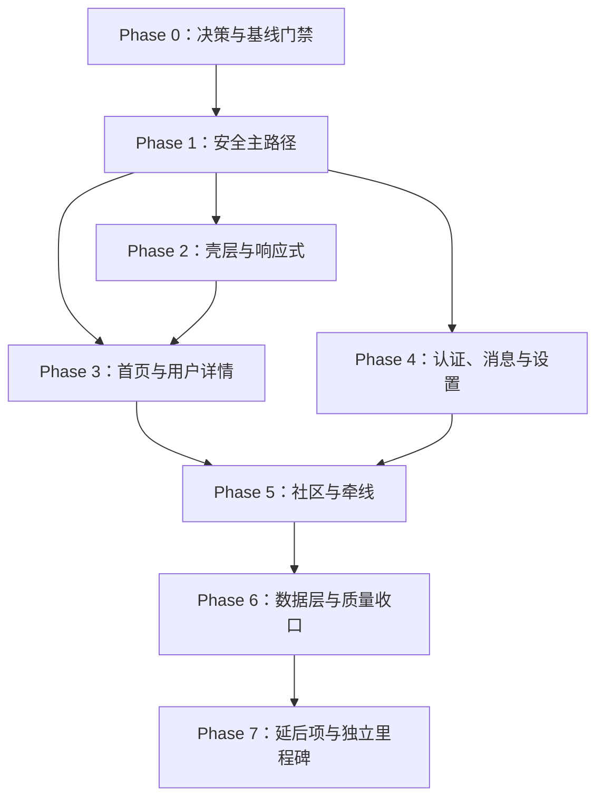

# 宣誓爱 · 下一阶段开发执行计划（HBuilderX / 微信小程序）

> **文档版本：** 2.0.0  
> **修订日期：** 2026-07-22  
> **状态：** 审查修订稿；Phase 0 决策冲突收口后进入生产实现  
> **目标工程：** UniApp / Vue 3 / UTS  
> **第一验收端：** 微信小程序（HBuilderX 编译 + 微信开发者工具）  
> **H5 定位：** 快速预览、冒烟和联调；不能替代微信小程序验收  
> **计划用途：** 约束下一阶段范围、任务顺序、文件影响面、验收证据与停止条件  
> **不承担：** 替代定版 PRD、批准受保护配置、承诺真实后端或支付已经可用

> **执行提醒：** 实施本计划时，应逐任务执行、逐任务验证；不要把多个阶段一次性铺开。涉及产品范围的冲突先更新定版 PRD，涉及 `pages.json`、`manifest.json` 或 `uniCloud-aliyun/` 的改动先取得明确授权。

---

## 0. 审查结论

原 v1.0.0 的方向基本正确：坚持 UniApp 主线、微信小程序优先、复用 Token 与 `Xsa*`、先补主路径再扩展次级能力。

但原文存在以下阻断问题，不能只做措辞润色：

1. **产品口径冲突。** 当前 `AGENTS.md` 的硬边界与 `PRODUCT.md` 在认证、收藏/喜欢、会员与爆灯范围上不一致。
2. **优先级失衡。** 原文把“壳层观感”放在安全主路径之前；认真婚恋产品应先保证认证、申请认识和禁聊门槛不可绕过。
3. **商业化越界。** 原文将会员套餐、VIP 引导、爆灯和 Mock 支付列为 P2 主交付，与本次 `AGENTS.md` 的本期边界冲突。
4. **受保护配置依赖不清。** Tab 顺序、Tab 图标和 custom 导航均可能修改 `pages.json`，必须作为审批门禁，不能混入“立即开工”。
5. **完成定义不完整。** `node tests/test-mock-system.js` 只能证明结构检查，不等于 HBuilderX 编译成功，也不等于微信小程序主路径通过。
6. **状态覆盖不足。** 原文提到 loading / empty / error，但没有把无权限、网络失败、重复提交、审核中和重试列入各阶段验收。
7. **不可移植引用。** 个人电脑上的绝对 HTML 原型路径不应成为执行依赖；视觉依据应回到仓库文档、分页面材料与截图。
8. **排期过度确定。** “两周质变”未声明不包含产品收口、配置审批、正式素材、真实接口、合规和平台审核时间。

### 0.1 当前已收口的三项冲突

| 主题 | 当前 `AGENTS.md` 硬边界 | 定版记录口径 | 本计划处理 |
|---|---|---|---|
| 认证门槛 | 常规互动、申请认识、参与话题 / 带话题发布均仅实名 | 双重认证 = 实名 + 学历人工审核通过（仅展示加分） | **话题门槛已收口为仅实名。** 单身承诺书仅作可选加分；审核中不能冒充通过 |
| 收藏 / 喜欢 | 喜欢 = 原收藏能力，仅自己可见 | 喜欢 = 仅自己可见列表 | **统一为用户级私有喜欢。** 与帖子点赞 `dynamic.liked`、帖子收藏 `dynamic.collected` 分离 |
| 会员 / VIP / 爆灯 | 不把会员订阅购买、VIP 开通引导或爆灯做成主路径 | 权益门槛 / 引导、爆灯 5 元、置顶付费本期做 | **不绕过安全主线。** 可按 PRD 做权益拦截与单次增值，但不能绕过认证、同意或安全能力 |

当前执行时：

- 可以进行代码审计、状态梳理、无争议的安全修复、组件复用和响应式修复。
- 不应把会员购买、VIP 引导、爆灯支付做成主路径，或以付费换取沟通权限。
- 不应把认证审核中、学历通过或其他可选认证冒充本期准入门槛已完成。
- 不应批量替换“收藏 / 喜欢”文案而不拆分行为与数据状态。

### 0.2 修订后的执行顺序

> **P0 决策与基线门禁 → P0 安全主路径 → P1 壳层与响应式 → P1 首页与核心页面质感 → P1 次级流程 → P2 数据层与质量 → 延后项**

安全与流程正确性高于“更像 HTML 原型”；视觉回迁不能改变产品语义，也不能绕过配置审批。

---

## 1. 依据、范围与不可绕过边界

### 1.1 需求与事实来源

实施前按以下顺序核对：

1. 用户本次任务的明确授权。
2. `PRODUCT.md`；若与当前 `AGENTS.md` 的硬边界冲突，先收口并更新 PRODUCT.md，不在代码中自行裁决。
3. `AGENTS.md` 的生产、安全、配置与验证约束。
5. `PRODUCT.md`、`DESIGN.md`、`uni.scss`。
6. 当前 `pages/`、`components/`、`api/`、`mock/` 和 `tests/`；现状只能证明“已经存在”，不能反向定义产品需求。

若存在 `../graphify-out/graph.json`，先从工作区根目录运行 `graphify query` 缩小范围，再回到源文件核对。图谱不是产品决策源。

### 1.2 本期产品硬边界

| 能力 | 本期执行口径 |
|---|---|
| 产品定位 | 认真婚恋，不做泛娱乐社交、颜值排行、低俗内容或 Tinder 式匹配 |
| 认证 | 常规互动、申请认识、参与话题 / 带话题发布均仅实名；双重认证仅展示加分；单身承诺书仅作可选加分；状态必须真实，审核中不能显示为通过 |
| 收藏 | 私有行为，仅自己可见 |
| 喜欢 | 原收藏能力，用户级私有列表；不得与帖子点赞或帖子收藏共用同一状态 |
| 申请认识 | 聊天前置门槛；展示申请状态并防止重复提交 |
| 聊天 | 仅双方同意后开放；此前不得进入聊天或交换联系方式 |
| 付费 | 不能绕过认证、双方同意、安全能力或沟通门槛 |
| 会员 / VIP / 爆灯 | 不进入本期关键路径；不新增订阅购买、VIP 强引导或爆灯主入口 |
| 文案 | 不承诺关系结果，不使用“命中注定、马上脱单、最后机会”等焦虑表达 |
| 收藏可见性 | 不向被收藏用户发送通知，不在公开资料中展示 |

### 1.3 工程硬边界

- 新页面放在 `pages/`，新组件放在 `components/`，工具放在 `utils/`。
- 页面只通过 `api/` 访问数据，不直接导入 `mock/`。
- 不新建 HTML 演示路线，不使用 `window`、`document` 或浏览器专属 DOM API。
- 颜色复用 `uni.scss` / `App.uvue` 既有 Token，不在业务页面散落新色值、`#000` 或 `#fff`。
- 新增 UI 前先检查现有 `Xsa*` 组件；优先增加可复用变体，不复制页面级组件。
- 覆盖 320px、375px、390px、428px；固定头部、底部 Tab 和操作栏必须给滚动内容预留空间。
- 图片优先 WebP，必要时 JPEG 降级；不能为视觉回迁引入无必要的大资源或新依赖。

### 1.4 受保护配置审批门

以下文件不在普通页面任务中顺带修改：

- `manifest.json`
- `pages.json`
- `uniCloud-aliyun/`
- 依赖大版本、已有依赖删除、发布 Tag 和未点名核心配置

涉及这些文件时，实施者必须先提交：

1. 修改目的。
2. 精确字段或目录。
3. 影响端与回滚方式。
4. 是否改变路由、权限、隐私声明或构建能力。
5. 用户明确确认记录。

未获确认时，只能准备差异说明和资源，不得落盘修改。

---

## 2. 当前工程基线

> 本节是 2026-07-22 的只读快照。开始新切片前必须重新核对，不能长期当作事实缓存。

### 2.1 已确认事实

- 工程使用 UniApp / Vue 3，页面与组件以 `.uvue` 为主，逻辑以 `.uts` 为主。
- 当前 `pages.json` 注册 14 个页面，底部五 Tab 为：首页、社区、牵线、消息、我的。
- 当前已有 15 个 `Xsa*` 组件。
- `api/` 与 `mock/` 已分层，`api/config.uts` 当前启用 Mock。
- 微信小程序应通过 HBuilderX 重新编译到 `unpackage/dist/dev/mp-weixin`，再由微信开发者工具验证。
- npm CLI 脚本当前不是可靠端侧门禁：根目录式工程与 `.uvue` 解析仍有已知限制。
- `pagesSub/profileExtra/vip.uvue` 等历史或预留页面存在，不等于本期获准继续扩展。

### 2.2 已确认风险

1. 首页与用户详情仍出现“喜欢”动作却反馈“已收藏”的混合语义。
2. `XsaUserCard` 暴露聊天事件，必须确认调用方不会让未同意用户直接进入聊天。
3. 认证展示包含实名、学历、头像、单身等多个维度，需要拆开“资料展示”与“本期准入门槛”。
4. 当前 Tab 顺序与定版材料存在差异，但修改 `pages.json` 仍需明确授权。
5. VIP 页面与相关文案是历史实现风险，不应被计划误写为本期主交付。
6. 现有测试以结构检查为主，核心状态机仍需通过代码审查和微信小程序场景回归证明。
7. 历史 `unpackage/` 产物不能证明本次源码可编译或行为正确。

### 2.3 本阶段完成定义

一个切片只有同时满足以下条件才算完成：

- 需求口径无未记录冲突。
- 受保护配置改动已获明确授权，或该切片完全不涉及受保护配置。
- 加载、空、错误、无权限、成功、重试、网络失败和重复提交状态已覆盖。
- `node tests/test-mock-system.js` 本次执行通过。
- `git diff --check` 本次执行通过。
- HBuilderX 已重新编译微信小程序，微信开发者工具关键场景通过。
- H5 只作为补充冒烟，不作为唯一验收证据。
- 320px、375px、390px、428px 无严重溢出或固定栏遮挡。
- 行为变化已同步到应更新的产品、设计或运行文档。
- 从工作区根目录执行 `graphify update .` 成功。

未执行 HBuilderX / 微信开发者工具验证时，只能写“代码与结构检查完成，端侧待验证”，不能写“已完成”或“已通过”。

---

## 3. 任务依赖图



- Phase 0 未通过，不进入产品语义改造。
- Phase 1 未通过，不以视觉完善掩盖禁聊、认证或重复提交问题。
- Phase 2 中涉及 `pages.json` 的部分可以被审批阻塞，但不阻塞无配置依赖的组件和页面响应式修复。
- Phase 7 不纳入本期 C 端完成声明。

---

## 4. 分阶段实施计划

### Phase 0 · 决策收口与可复现基线（约 0.5–1 人日）

**目标：** 让后续开发只有一个可执行答案，并建立可重复验证的起点。

**重点文件**

- `AGENTS.md`
- `PRODUCT.md`
- `DESIGN.md`
- `docs/PROJECT_STATUS.md`
- `docs/HOW_TO_RUN.md`
- `pages.json`（只读核对）

**任务**

- [ ] 将认证门槛、收藏/喜欢语义、会员/VIP/爆灯边界形成决策差异表。
- [ ] 由产品决策源收口冲突；重大产品变更先更新根目录 PRD。
- [ ] 明确 Tab 顺序是否维持现状或按定版调整，并单独取得 `pages.json` 修改授权。
- [ ] 明确首页是否改 `navigationStyle: custom`，同样作为 `pages.json` 审批项。
- [ ] 运行基线结构测试并记录结果。
- [ ] 使用 HBuilderX 重新编译 `mp-weixin`，记录版本、目标端、时间和第一条错误或成功结果。
- [ ] 在微信开发者工具保存首页、用户详情、申请认识、消息、聊天、认证中心的基线截图。
- [ ] 记录当前未提交改动，后续只修改任务点名文件。

**完成标准**

- [ ] 三项产品冲突均为“已确认”或“明确阻塞”，没有默认猜测。
- [ ] 受保护配置的授权范围有书面记录。
- [ ] 基线测试和端侧结果可复现。

**停止条件**

若认证或收藏/喜欢仍无唯一口径，停止对应业务实现；只允许继续做不改变语义的视觉与技术债任务。

---

### Phase 1 · P0 安全主路径与互动语义（约 2–3 人日）

**目标：** 收藏、喜欢、申请认识和聊天各自独立，任何入口都不能绕过认证与双方同意。

**重点文件**

- `pages/index/index.uvue`
- `pagesSub/userExtra/user/detail.uvue`
- `components/XsaUserCard.uvue`
- `pages/message/message.uvue`
- `pagesSub/chat/detail.uvue`
- `api/user.uts`
- `api/message.uts`
- `mock/user.uts`
- `mock/message.uts`
- `tests/test-mock-system.js`

#### 1.1 拆分收藏与喜欢

- [ ] 私有收藏使用独立状态与明确文案，例如“已收藏，仅自己可见”。
- [ ] 喜欢作为轻意向单独提交，不复用收藏列表或收藏 Toast。
- [ ] 首页、用户详情、用户卡和“我的”入口命名一致。
- [ ] 对取消、失败、重复点击和网络失败给出可理解反馈。
- [ ] 收藏不产生对方可见通知；喜欢是否产生通知按 Phase 0 已确认口径执行。

#### 1.2 申请认识状态机

建议最小状态：

```text
idle
  → submitting
  → pending
  → accepted
  → rejected / expired
  → failed（可重试）
```

另有前置阻断状态：

```text
unauthenticated
certification_required
permission_denied
```

- [ ] `submitting` 时禁用重复提交。
- [ ] `pending` 时所有入口显示一致，不重复扣次数或重复创建申请。
- [ ] `rejected` / `expired` 的再次申请规则必须来自已确认需求，不在页面自行决定。
- [ ] 申请失败不得伪装成功，不静默吞错。
- [ ] 确认层明确“双方同意后才能聊天和交换联系方式”。

#### 1.3 聊天门禁

- [ ] `pagesSub/chat/detail.uvue` 进入时重新校验会话是否为双方已同意状态，不能只依赖按钮是否隐藏。
- [ ] 首页、用户详情、用户卡和消息列表的所有聊天入口使用同一门禁。
- [ ] 未同意时不渲染手机号、微信号或引导绕过平台沟通。
- [ ] 被拒绝、过期、拉黑、无权限和网络失败都有明确退出或重试路径。

**验收场景**

| 场景 | 预期 |
|---|---|
| 未登录点击申请认识 | 跳转登录或显示登录门槛，不创建申请 |
| 未完成本期认证门槛 | 展示真实缺失项，不显示已认证 |
| 连续点击申请 | 只创建一次，按钮处于提交中或待处理 |
| 对方未同意时进入聊天 URL | 被路由/页面门禁拦截 |
| 双方同意 | 才创建或开放会话 |
| 请求超时 | 显示失败与重试，不扣除成功次数 |
| 收藏用户 | 仅自己的收藏状态改变 |
| 喜欢用户 | 仅执行轻意向逻辑，不写入收藏状态 |

---

### Phase 2 · P1 壳层、图标与响应式（约 1–2 人日；配置项需审批）

**目标：** 在不牺牲安全主路径的前提下，提升微信小程序第一屏完成度。

**重点文件**

- `pages.json`（受保护，需明确授权）
- `pages/index/index.uvue`
- `pages/community/community.uvue`
- `pages/matchmaker/matchmaker.uvue`
- `pages/message/message.uvue`
- `pages/profile/profile.uvue`
- `components/XsaTabs.uvue`
- `components/XsaUserCard.uvue`
- `static/icons/`
- `uni.scss`（仅在既有 Token 无法表达且完成设计评审时修改）

**任务**

- [ ] 先准备五 Tab 的普通态 / 选中态图标和尺寸清单，不先改 `pages.json`。
- [ ] 获授权后，仅修改确认过的 tabBar 顺序、图标和静态平台色值。
- [ ] custom 导航需单独审批；未获授权时维持系统导航并只修页面内容区。
- [ ] 主操作图标不使用 emoji；装饰性 emoji 也应克制并通过设计检查。
- [ ] 固定操作栏、AI 浮动入口和原生 TabBar 不重叠。
- [ ] 页面底部使用安全区和内容预留，不通过硬编码单一机型高度解决。
- [ ] 在 320px、375px、390px、428px 分别检查横向溢出、按钮截断和滚动遮挡。

**完成标准**

- [ ] 未经确认的 `pages.json` 变更为零。
- [ ] 获授权的配置差异只包含已批准字段。
- [ ] 五个 Tab 的图标、选中态和文案清晰一致。
- [ ] 固定栏在四档宽度下不遮挡最后一屏内容。

---

### Phase 3 · P1 首页与用户详情质感（约 2–3 人日）

**目标：** 复用同一套故事与档案组件，让首页和用户详情达到小程序可实现的高保真水平。

**视觉依据**

- `DESIGN.md`
- `uni.scss`
- `PRODUCT.md` 中对应页面材料与截图
- 可用的最终 HTML 原型仅作只读视觉参考，不作为生产入口或运行依赖

**重点文件**

- `pages/index/index.uvue`
- `pagesSub/userExtra/user/detail.uvue`
- `components/XsaUserCard.uvue`
- `components/XsaTag.uvue`
- `components/XsaSheet.uvue`
- `components/XsaModal.uvue`
- `static/portraits/`

**任务**

- [ ] 抽取首页与用户详情共同的数据展示规则，避免姓名、认证、标签和状态两套实现。
- [ ] 故事模块按实际信息组织：主图、基础资料、回答、可信档案、生活切片、关系期待和完整档案。
- [ ] 认证只展示真实状态；不要写固定的“VERIFIED 4/4”。
- [ ] 图片加载失败有降级；列表和广场资源使用合适尺寸与懒加载策略。
- [ ] 推荐与广场入口不直接进入聊天。
- [ ] 收藏、喜欢、申请认识三个动作视觉层级不同，文案和状态与 Phase 1 一致。
- [ ] AI 相关内容标明仅供参考，不承诺匹配或关系结果。
- [ ] 广场布局优先验证信息可读性；双列仅在 320px 下仍可读时采用，否则使用自适应变体。

**完成标准**

- [ ] 首页与用户详情的同一字段和认证状态无矛盾。
- [ ] 无硬编码虚假认证数量或审核结果。
- [ ] 320px 下信息不挤压，428px 下不过度拉伸。
- [ ] 视觉增强没有改变互动语义或聊天门槛。

---

### Phase 4 · P1 登录、认证、消息与设置（约 2 人日）

**目标：** 补齐准入、安全与账户管理状态，不把占位页面描述成生产完成。

**重点文件**

- `pages/auth/login.uvue`
- `pages/auth/register.uvue`
- `pagesSub/profileExtra/certification.uvue`
- `pages/profile/profile.uvue`
- `pagesSub/profileExtra/settings.uvue`
- `pages/message/message.uvue`
- `api/message.uts`
- 相关 `mock/*.uts`

**任务**

- [ ] 登录与注册覆盖协议未勾选、验证码发送中、倒计时、错误、网络失败和重复提交。
- [ ] 认证中心按“未开始 / 提交中 / 审核中 / 通过 / 驳回 / 失败”展示真实状态。
- [ ] 常规互动、申请认识、参与话题 / 带话题发布均仅校验实名；双重认证仅作展示加分；单身承诺书仅作可选加分。
- [ ] 不允许审核中状态点亮“已完成门槛”。
- [ ] 消息页区分认识申请、系统安全消息和已开放会话。
- [ ] 设置页保证隐私、黑名单、举报和账号安全路径可达。
- [ ] 不新增会员订阅、VIP 开通或爆灯主入口；现有历史入口按 Phase 0 决策隐藏、隔离或后续清理。

**完成标准**

- [ ] 未完成门槛的用户不能进入受限动作。
- [ ] 认证失败与驳回均有下一步，不展示假成功。
- [ ] 举报、拉黑后，相关申请与会话权限及时更新。
- [ ] 消息页不存在未同意用户的可发送会话。

---

### Phase 5 · P1 社区与牵线（约 2 人日）

**目标：** 保留认真婚恋与可信服务气质，不扩张为泛娱乐社交或付费承诺。

**重点文件**

- `pages/community/community.uvue`
- `pagesSub/community/publish.uvue`
- `pages/matchmaker/matchmaker.uvue`
- `components/XsaDynamicCard.uvue`
- `components/XsaPhotoGrid.uvue`
- `api/community.uts`
- `api/matchmaker.uts`
- `mock/community.uts`
- `mock/matchmaker.uts`

**任务**

- [ ] 社区信息流覆盖加载、空、错误、无权限、发布中、发布失败与重试。
- [ ] 发布入口明确内容规范、隐私提示和举报机制。
- [ ] 不做颜值榜、无限刷卡、暧昧诱导或低俗互动。
- [ ] 牵线服务展示资质、服务边界和咨询方式，不承诺结果。
- [ ] AI 红娘标明仅供参考，不能代替人工核验与安全判断。
- [ ] 本期不把会员、VIP、爆灯或不透明付费作为转化主路径。
- [ ] 真实下单与支付若未来启动，应成为独立里程碑，并先完成合规、价格、退款与支付失败设计。

**完成标准**

- [ ] 社区和牵线没有结果承诺、虚假倒计时或焦虑营销。
- [ ] 发布失败不丢失用户输入，重复提交不会产生重复内容。
- [ ] 服务咨询不绕过平台安全规则或提前交换联系方式。

---

### Phase 6 · P2 数据层、组件债与质量收口（约 1–2 人日）

**目标：** 让关键页面共享一致状态和错误处理，为后续真实接口联调保留稳定契约。

**重点文件**

- `api/config.uts`
- `api/request.uts`
- `api/*.uts`
- `mock/*.uts`
- `components/XsaButton.uvue`
- `components/XsaUserCard.uvue`
- `components/XsaMessageItem.uvue`
- `components/XsaEmpty.uvue`
- `components/XsaToast.uvue`
- `tests/test-mock-system.js`
- `docs/Mock使用与退役约定.md`

**任务**

- [ ] 页面只调用 `api/`；Mock 与真实接口分支返回同一字段与状态语义。
- [ ] 统一关键动作的 loading、success、empty、error、permission denied、network failure 和 retry 表达。
- [ ] 请求层区分业务拒绝、鉴权失败、网络失败和服务异常，不统一伪装成成功 Toast。
- [ ] 组件增加状态时优先做可复用变体，不在页面复制样式。
- [ ] 扩展结构测试：检查页面/API/Mock 边界、关键文件存在、禁用的浏览器 API 和高风险文案残留。
- [ ] 明确 `node tests/test-mock-system.js` 的能力边界：它不替代 HBuilderX 编译与微信运行时回归。
- [ ] Mock 退役按模块进行；未经真实接口、鉴权、错误码和双端回归，不把 `USE_MOCK = false` 写成上线完成。

**完成标准**

- [ ] 关键页面没有直接导入 `mock/`。
- [ ] 同一错误在不同页面有一致含义和可操作下一步。
- [ ] 真实接口切换不会改变收藏、喜欢、申请认识和聊天的产品语义。

---

### Phase 7 · 延后项与独立里程碑

以下内容不纳入本期核心交付，也不能用于绕过 Phase 0–6：

| 项目 | 启动前置条件 |
|---|---|
| 会员订阅购买 / VIP 开通 | 根目录 PRD 明确批准；权益、价格、退款、连续订阅和限制透明；不得绕过双方同意或安全门槛 |
| 爆灯 | 根目录 PRD 明确批准其定位、可见性、频控、投诉和退款规则；不得成为首页主路径 |
| 置顶或曝光付费 | 明确广告/推荐标识、排序规则、价格与投诉处理 |
| 红娘在线支付 | 明确服务合同、价格、退款、履约和支付失败状态 |
| 真实实名认证 / 学历 / 人脸能力 | 完成供应商、隐私、授权、数据保留和失败处理评审；涉及配置时取得授权 |
| 管理后台 | 独立 Web / 管理端计划，不塞入小程序五 Tab，不阻塞 C 端安全主路径 |
| npm CLI 架构迁移 | 独立技术方案；不得复制双份 `manifest.json` / `pages.json` 掩盖根目录式工程问题 |

现有 `pagesSub/profileExtra/vip.uvue` 或 Mock 支付代码只能视为历史/预留实现。未经 Phase 0 收口，不扩展入口、不写成本期完成项。

---

## 5. 推荐排期与里程碑

> 以下为纯前端、Mock 驱动、素材基本可用情况下的开发量估算，不包含产品决策等待、受保护配置审批、真实后端、第三方认证、支付、合规、平台审核和正式素材制作。

| 里程碑 | 预计人日 | 可独立验收的交付 |
|---|---:|---|
| M0 决策与基线 | 0.5–1 | 唯一执行口径、配置授权记录、端侧基线 |
| M1 安全主路径 | 2–3 | 收藏/喜欢拆分、申请状态、双方同意后聊天 |
| M2 壳层与响应式 | 1–2 | 图标、固定栏、安全区、四档宽度；配置改动视授权 |
| M3 首页与用户详情 | 2–3 | 真实认证展示、故事与档案一致、核心动作一致 |
| M4 登录认证消息设置 | 2 | 准入状态、申请消息、隐私举报与失败状态 |
| M5 社区与牵线 | 2 | 可用但不娱乐化、不结果承诺、不付费绕过 |
| M6 数据与质量 | 1–2 | API/Mock 契约、错误语义、组件与测试收口 |

**合计：约 10.5–15 人日。** 若 Phase 0 冲突未收口，排期从收口完成后重新计算。

### 建议提交粒度

每个提交只覆盖一个可独立回归的行为，例如：

1. `fix: split favorite and like semantics`
2. `fix: enforce mutual-consent chat gate`
3. `fix: show real certification states`
4. `feat: add responsive home action dock`
5. `refactor: unify user card action states`

不要把产品语义、路由配置、全站视觉和 Mock 重构塞入同一提交。

---

## 6. 每个切片的执行 SOP

1. **读规则：** 先读 `AGENTS.md`，再读已收口的定版决策与对应分页面需求。
2. **查图谱：** 若 `../graphify-out/graph.json` 存在，从工作区根目录运行 `graphify query`；随后回源文件核对。
3. **查工作区：** 记录 `git status --short --branch`，保留用户已有改动。
4. **列文件：** 写清本切片允许修改、只读和禁止修改的文件。
5. **先验收例：** 为状态机列出正常、失败、无权限、网络失败和重复提交场景。
6. **先最小验证：** 能自动化的行为先增加失败检查，再实现最小改动。
7. **复用组件：** 优先升级现有 `Xsa*` 变体；不散落新 Token 或页面级重复样式。
8. **H5 冒烟：** 只用于快速发现明显问题，并记录其局限。
9. **微信验收：** HBuilderX 重新编译 `mp-weixin`，微信开发者工具回归关键场景。
10. **尺寸回归：** 320px、375px、390px、428px 检查滚动、固定栏和文本截断。
11. **自动检查：** 每次都运行 `node tests/test-mock-system.js` 与 `git diff --check`，不是只在修改 Mock 时运行。
12. **记录证据：** 写明通过项、未验证项、失败日志第一条、截图和已知限制。
13. **同步文档：** 产品、设计、运行或状态变化回写对应权威文档。
14. **更新图谱：** 从工作区根目录执行 `graphify update .`。

---

## 7. 微信小程序回归矩阵

### 7.1 核心流程

- [ ] 未登录 → 尝试收藏 / 喜欢 / 申请认识。
- [ ] 已登录但未完成本期认证门槛 → 尝试申请认识。
- [ ] 收藏 → 列表可见且仅自己可见。
- [ ] 喜欢 → 轻意向状态正确，不污染收藏。
- [ ] 申请认识 → 提交中 → 待处理 → 拒绝。
- [ ] 申请认识 → 提交中 → 待处理 → 同意 → 开放聊天。
- [ ] 待处理状态重复点击，不产生重复申请。
- [ ] 未同意用户通过页面入口或直接路由进入聊天，均被拦截。
- [ ] 拉黑 / 举报后，申请与聊天权限及时变化。

### 7.2 页面状态

每个关键页面至少覆盖：

- [ ] loading
- [ ] empty
- [ ] error
- [ ] permission denied
- [ ] success
- [ ] retry
- [ ] network failure
- [ ] duplicate submission disabled

### 7.3 视觉与兼容

- [ ] 320px、375px、390px、428px 无横向滚动。
- [ ] 固定顶栏、底部 Tab、操作栏和 FAB 不遮挡内容。
- [ ] 主操作无 emoji 图标。
- [ ] 业务样式无新增未评审色值、`#000` 或 `#fff`。
- [ ] 图片失败有占位；列表图片尺寸与 `mode` 合理。
- [ ] H5 与微信小程序使用同一 Token 语义。

### 7.4 产品与安全

- [ ] 实名、学历与单身承诺书状态真实展示；不同门槛不得混用。
- [ ] 用户级喜欢、帖子点赞与帖子收藏文案、数据和可见性不混用。
- [ ] 双方同意前不能聊天或交换联系方式。
- [ ] 付费不能绕过认证、同意、安全和投诉能力。
- [ ] 会员、VIP、爆灯未进入本期主路径。
- [ ] AI 与红娘服务无关系结果承诺。
- [ ] 举报、黑名单、隐私和安全提示可达。

### 7.5 工程证据

- [ ] `node tests/test-mock-system.js`：记录时间与完整结果。
- [ ] `git diff --check`：记录退出码。
- [ ] HBuilderX：记录版本、运行目标和重新编译结果。
- [ ] 微信开发者工具：记录基础库、关键路径和截图。
- [ ] H5：若执行，仅标注为冒烟结果。
- [ ] `graphify update .`：从工作区根目录执行并记录结果。

---

## 8. 交付记录模板

```text
切片：
需求依据：
产品口径状态：已确认 / 阻塞
修改文件：
受保护配置：未涉及 / 已获授权（范围：）
数据源：Mock / 真实接口 / 混合
自动检查：
- node tests/test-mock-system.js：
- git diff --check：
HBuilderX：
微信开发者工具：
H5 冒烟：
尺寸：320 / 375 / 390 / 428
核心场景：
失败与重试场景：
文档同步：
未验证项：
已知限制：
```

---

## 9. 相关文档

| 文档 | 用途 |
|---|---|
| `AGENTS.md` | 生产实现、安全、保护文件与验证硬边界 |
| `PRODUCT.md` | 产品范围、流程、安全与商业化说明 |
| `DESIGN.md` / `uni.scss` | 视觉规则、Token 与组件语言 |
| `docs/PROJECT_STATUS.md` | 当前实现与已知差异，不等于需求源 |
| `docs/HOW_TO_RUN.md` | HBuilderX、微信开发者工具与 npm CLI 限制 |
| `docs/TROUBLESHOOTING.md` | 编译和运行排障 |
| `docs/小程序UI样式注意事项.md` | 小程序样式与兼容问题 |
| `docs/MOCK_API_GUIDE.md` | API / Mock 使用说明 |
| `docs/Mock使用与退役约定.md` | Mock 契约、切换与退役门槛 |
| `docs/图片上传与包体注意事项.md` | 图片、上传和包体约束 |
| `docs/开发自检清单.md` | 合并、提测和交付前检查 |

---

## 10. 下一步

**先执行 Phase 0，不直接改 `pages.json`，也不继续扩展会员、VIP、爆灯或支付。**

Phase 0 完成后，第一个生产切片应是：

> **拆分收藏与喜欢语义，并把申请认识 → 双方同意 → 聊天做成所有入口都无法绕过的统一状态机。**

只有安全主路径通过微信小程序回归后，再进入壳层、首页和其他页面的高保真提升。

---

## 修订记录

| 版本 | 日期 | 说明 |
|---|---|---|
| 2.0.0 | 2026-07-22 | 审查重构：增加决策冲突门禁；按当前 `AGENTS.md` 收紧认证、收藏/喜欢和商业化边界；安全主路径前置；补齐受保护配置审批、状态矩阵、端侧证据与真实排期范围 |
| 1.0.0 | 2026-07-22 | 首版：HBuilderX 约束下的分阶段开发计划 |

